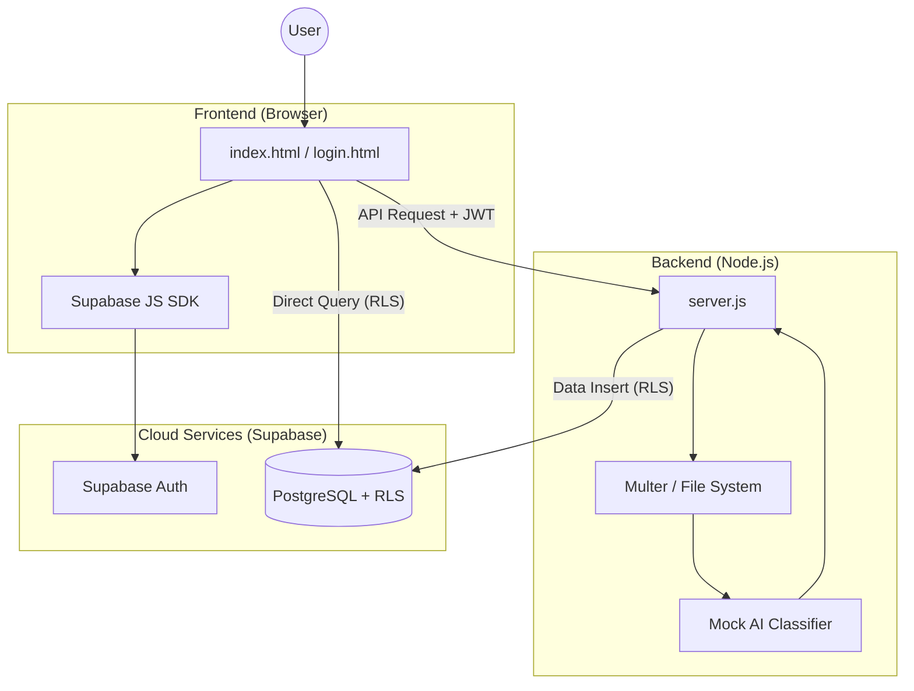

# System Design & Architecture: Ganesh Store AI Pipeline

This document provides a comprehensive overview of the technical architecture, project evolution, and data flow of the **Ganesh Store AI Pipeline**.

## 1. High-Level Architecture
The system follows a modern **Client-Server-Cloud** architecture, leveraging Supabase for security and database management.

---

## 2. Project Evolution: From Prototype to Advanced
The project evolved through five distinct phases of development:

1.  **Phase 1: Local Prototype**: Basic HTML/CSS visual gallery (no saving).
2.  **Phase 2: Persistence**: Introduced Node.js and `db.json` for local storage and uploads.
3.  **Phase 3: AI Automation**: Added the **Mock AI Engine** for automatic categorization and tagging.
4.  **Phase 4: Multi-User Auth**: Integrated **Supabase Auth** for secure, private user sessions.
5.  **Phase 5: Advanced Cloud**: Implemented **PostgreSQL with RLS** (Row-Level Security) for 100% private data isolation and **Batch Deletion** for inventory management.

---

## 3. Technology Stack Breakdown
| Component | Technology | Purpose |
|---|---|---|
| **Frontend** | Vanilla HTML5 / CSS3 | Modern "Dark Glassmorphism" UI with Syne & DM Mono fonts. |
| **Auth** | Supabase Auth | Secure login, signup, and JWT session handling. |
| **Backend** | Node.js + Express | API orchestration, file handling via **Multer**. |
| **AI Engine** | Mock AI Simulation | Keyword extraction logic for instant, cost-free analysis. |
| **Database** | Supabase PostgreSQL | Secure metadata storage with **Row-Level Security (RLS)**. |
| **Storage** | Hybrid Local/DB | Files stored on disk (`/catalog`), metadata stored in Cloud DB. |

---

## 4. Key Security Features
-   **JWT Tokens**: Every backend request requires a valid, time-limited token from Supabase.
-   **RLS Policies**: Standard Postgres policies (`auth.uid() = user_id`) ensure that **User A can NEVER see User B's products**.
-   **Zero-Trust DB**: Even if the backend is compromised, the database only allows access to rows owned by the authenticated user.

---

## 5. Performance Features
-   **Bulk Management**: A selection system allows users to "Select All" and delete hundreds of items in a single batch.
-   **Job Queuing**: Backend processes large uploads sequentially (one-by-one) to maintain stability.
-   **Optimized Rendering**: Frontend uses grid/list view toggling with efficient DOM updates.
